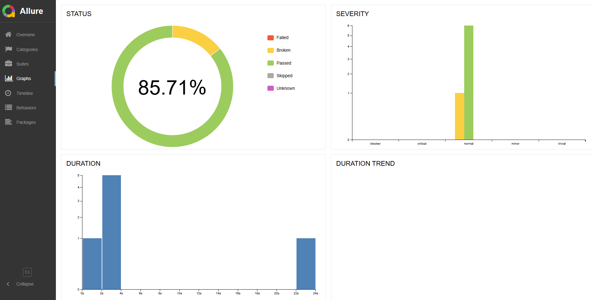
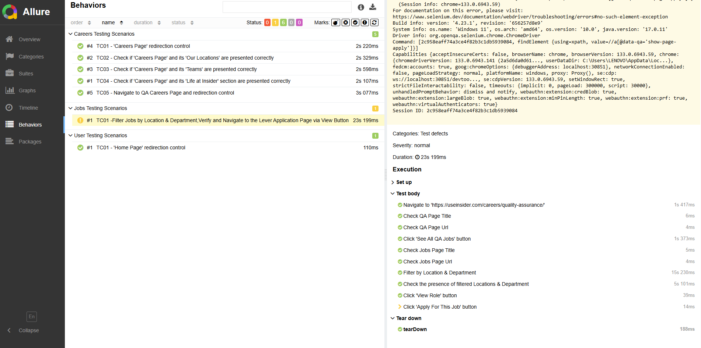
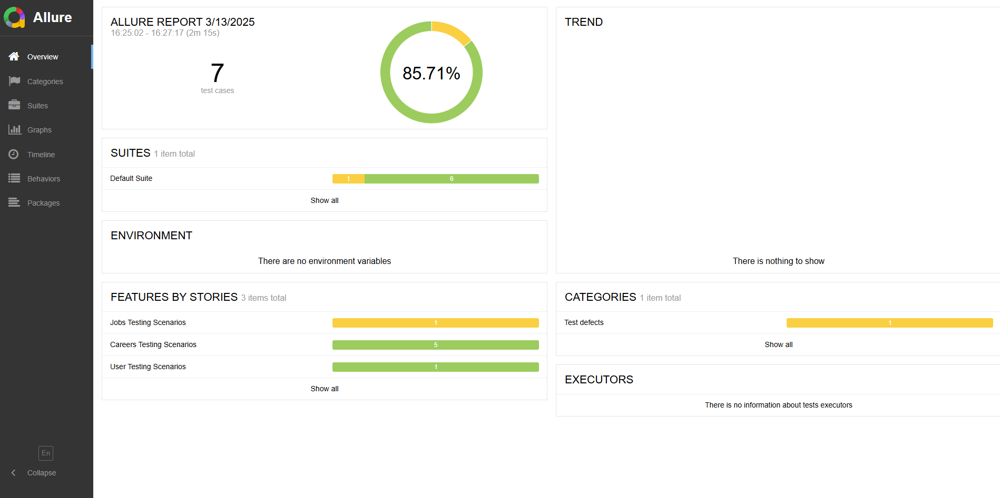
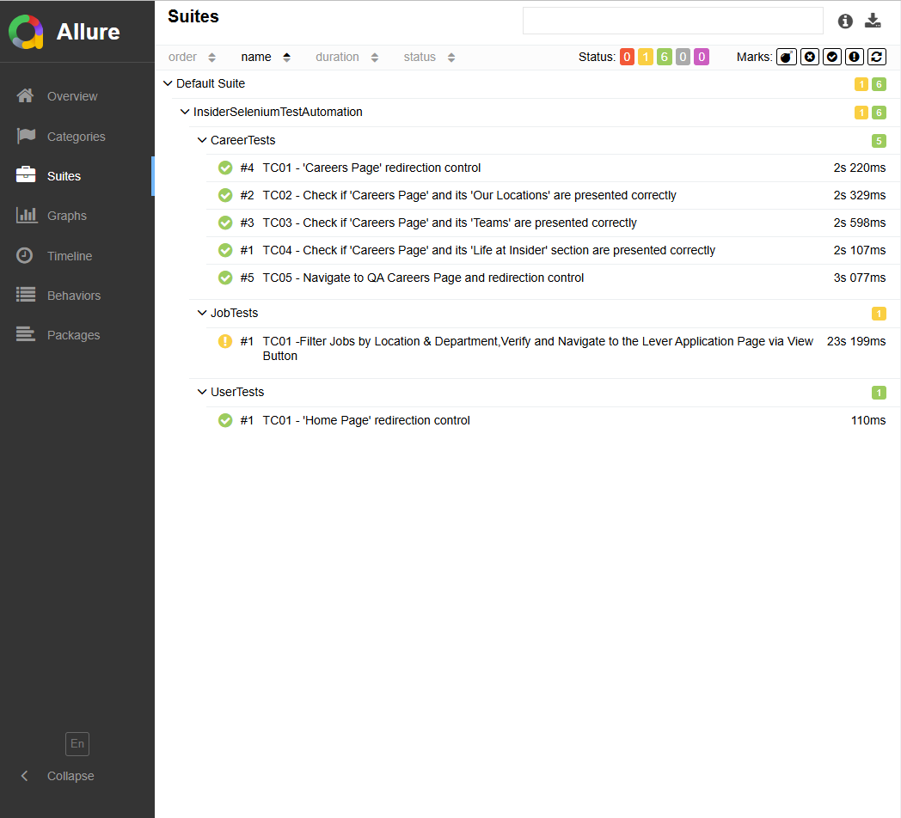
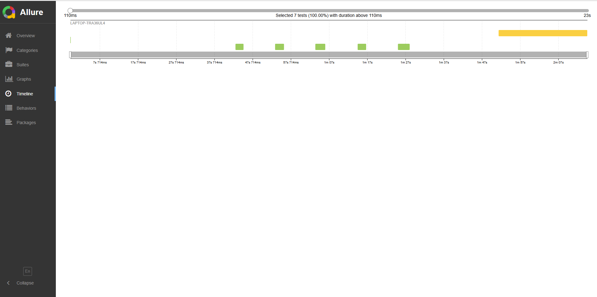

<h1>INSIDER QA AUTOMATION TASK</h1>

Developed as a Insider task, this project targets the testing of the useinsider.com website. It employs JUnit and Selenium for test automation, and Allure Report for visualizing test results.

<h2>Content Overview</h2>
<ul>
  <li> <a href="#description">Project Decription</a></li>
  <li> <a href="#configuration">Project Configuration</a></li>
  <li> <a href="#tests">Tests</a></li>
  <li> <a href="#results">Results</a></li>
  <li> <a href="#screenshots">Screenshots</a></li>

</ul>

<h3 id="description">Project Description</h3>

This project is crafted to thoroughly test the functionalities of the <a href="https://useinsider.com/">insider</a> website. Using JUnit and Selenium, functional tests and user scenarios are meticulously executed. Detailed test reports are produced with the help of Allure Report.

<h3 id="configuration">Project Configuration</h3>
<h4>Requirements</h4>
<ul>
  <li><a>Java 11 or above</a></li>
  <li><a>Maven</a></li>
  <li><a>Selenium WebDriver</a></li>
  <li><a>Allure Commandline</a></li>
</ul>

<h3 id="tests">Tests</h3>

<ul>
  <li>
    <strong>Functional Tests:</strong> Tests the functionality of the web application.
  </li>
  <li>
    <strong>User Scenarios:</strong> Simulates specific user scenarios.
  </li>
  <li>
    <strong>Regression Tests:</strong> Verifies that existing features work after software updates.
  </li>
</ul>

<h3 id="results">Results</h3>

With Allure Report, test results are visually presented, providing comprehensive reports that include test successes, failures, execution times, and other key metrics.

<h3 id="screenshots">Screenshots</h3>
<ul>
    <li></li>
    <li></li>
    <li></li>
    <li></li>
    <li></li>
    
</ul>
